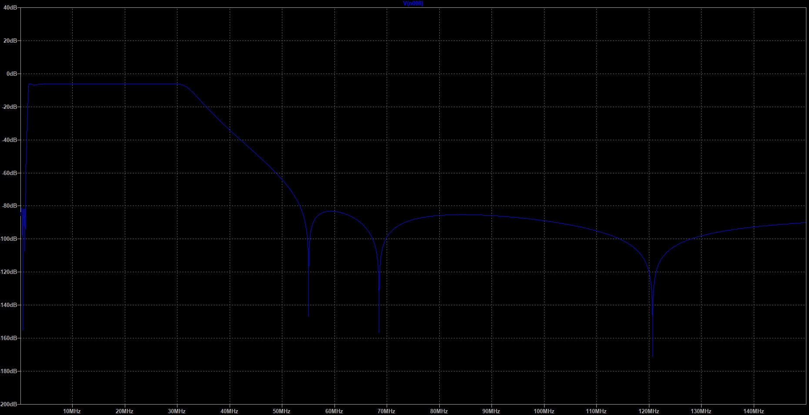

# Short wave BPF

This is HW design of passive shortwave BPF 1.8MHz - 30MHz.

The schematic is based on 1.8MHz 7-th order elliptic HPF and 30MHz 7-th order elliptic LPF.

Input output filter resistance is 50 Ohms.

Loses in band-pass are less than -6.8dB. Loses at 60MHz and more are more than -80 dB. The same situation for frequencies lower than  1MHz - -80dB.

The design is created to use together with SDR receivers due to problematic reception of shot-wave bands in city conditions. This situation is mainly caused by huge noise from different switch power converters/inverters at low frequencies and FM radios at high frequencies.

## Folder structure

- **HF-BPF.asc** - LTspice simulation.  https://www.analog.com/en/design-center/design-tools-and-calculators/ltspice-simulator.html

- **HF-BPF.pro** - KiCad project. https://kicad-pcb.org/

- **HF-BPF.sch** - KiCad schematic.

- **HF-BPF.kicad_pcb** - KiCad PCB.

- **HF-BPF.net** - KiCad net-list file.

- **Manufacture** - Gerber files for PCB manufacturing. PCB manufacture https://www.elecrow.com/pcb-manufacturing.html

# Amplitude-frequency characteristic

